# Ticket Bus

## Tu viaje en un solo Ticket
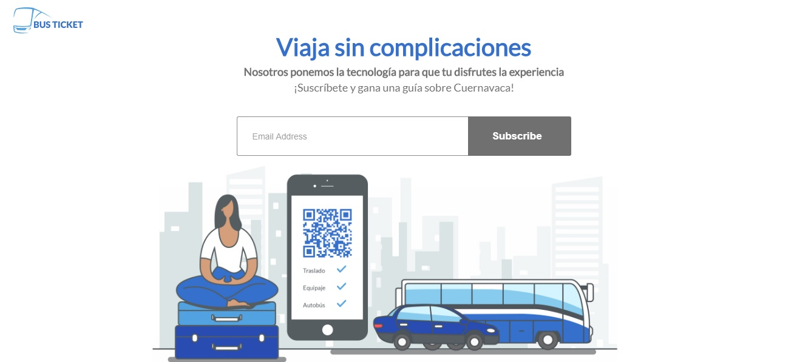

### Desarrollado para
<hr>
### Laboratoria
<hr>

### El reto
Optimizar el viaje de Cuernavaca a la Ciudad de México en autobús, e incrementar el número de venta de boletos de autobús del trayecto Ciudad de México – Cuernavaca a través de Internet.

Actualmente el viaje en autobús es una experiencia que puede mejorar porque el servicio se ha enfocado en el número de boletos que vende para sus corridas sin preocuparse por la experiencia de sus usuarios


### Fases del proceso

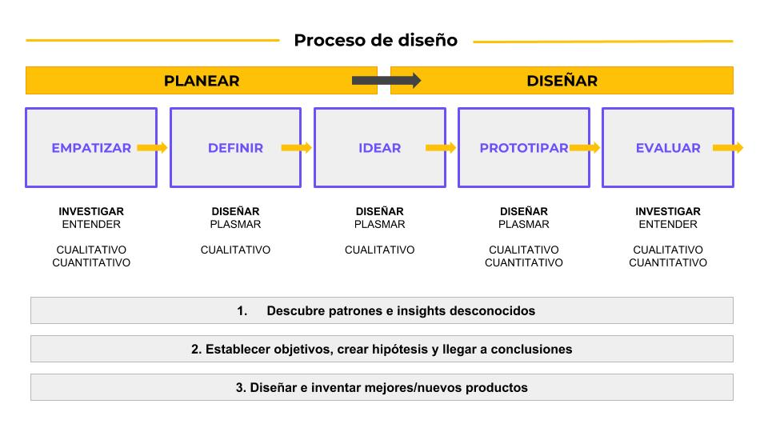

Se conformaron equipos de 3-4 personas, donde a cada una se le asignaba un rol específico: Product Owner, Research y Design

### Investigación
En esta etapa comenzamos a hacer investigaciones sobre las diferentes lineas de autobuses que viajan hacia Cuernavaca con el objetivo de conocer el proceso que se tiene que seguir así como entender cuáles son las necesidades de los usuarios.

Algunos de los problemas que se detectaron fueron que el usuario no encuentra en un sólo lugar todos los horarios de salidas de autobús y tiene muchos documentos para realizar su viaje.

De la misma manera notamos algunas necesidades como son la facilidad para adquirir sus boletos, llegar a la terminal, documentar su equipaje, abordar el autobús y su traslado hacia su destino final una vez que desciende de la unidad.

Entre quienes brindan actualmente estos servicios a mejorar destacan:
* Clickbus. Porque ofrece acceso a la información de diferentes líneas en un solo sitio.


* Pero les falta: Un sitio mobile friendly. Un diseño intuitivo. Un solo documento que facilite todo el trámite.


A partir de aquí se utilizó la herramienta Google forms y se llevó a cabo una encuesta a las personas que constantemente viajan hacia allá, ya sea por placer o negocios.

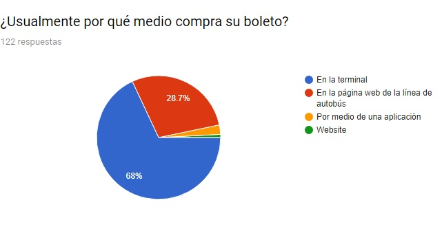

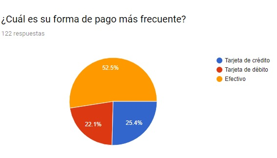

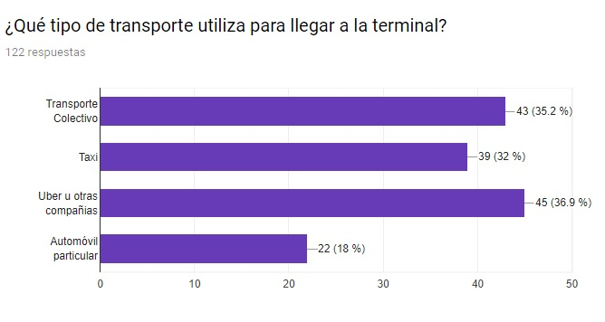

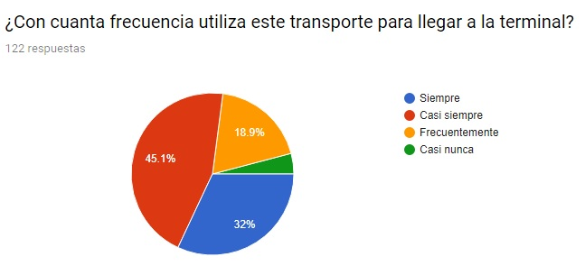

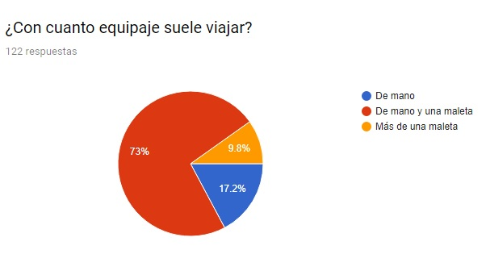

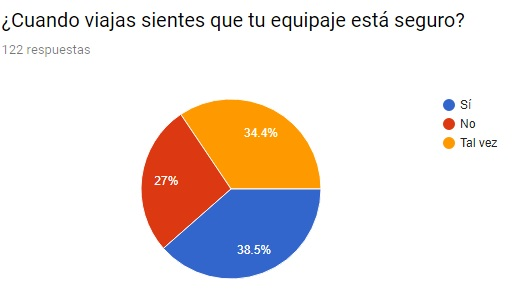

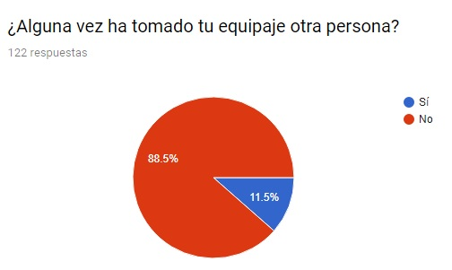

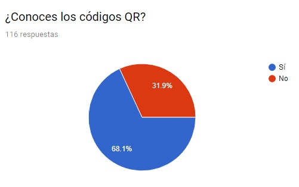

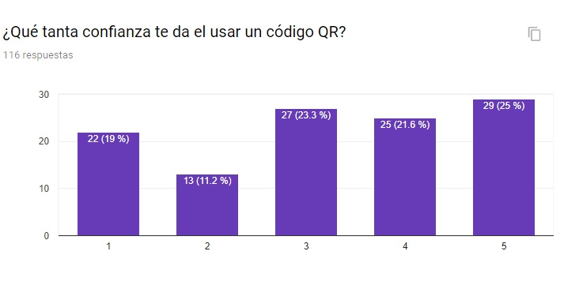

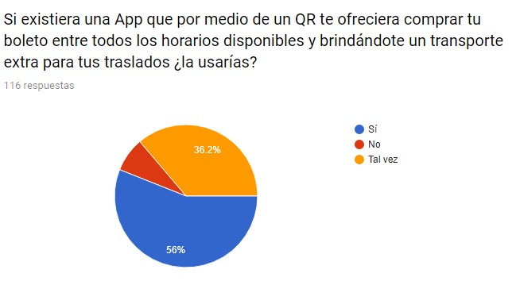


#### Se detectaron los siguientes insights:

- [x] 70% Prefiere alquilar transporte privado para trasladarse hasta la terminal
- [x] 63% Desea encontrar todas las lineas disponibles en un solo lugar
- [x] 11% Ha tenido algún incidente con el manejo de su equipaje
- [x] 67% Conoce y considera los códigos QR confiables

### Definir

¿Cómo describiríamos a los usuarios? (Edad, experiencia, educación, etc...)
Habitantes de la zona metropolitana que viajan a la ciudad de Cuernavaca. Clase media, con una edad entre 18 y 45 años, con preferencias por la tecnología, sentido del servicio al cliente y que valoran el ahorro en tiempo y tramites.

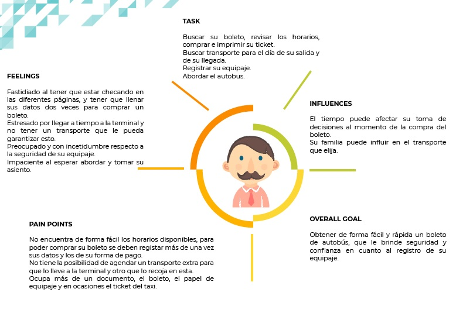

#### Descripción de la solución:

Una web-app en la que el usuario pueda encontrar todos los horarios disponibles para Cuernavaca. Que le genere un único documento (código QR) con la información de su viaje para no tener que estar pendiente de todos los documentos que se generan

### Ideación

En esta etapa se llevó a cabo la planeación de cómo sería el diseño

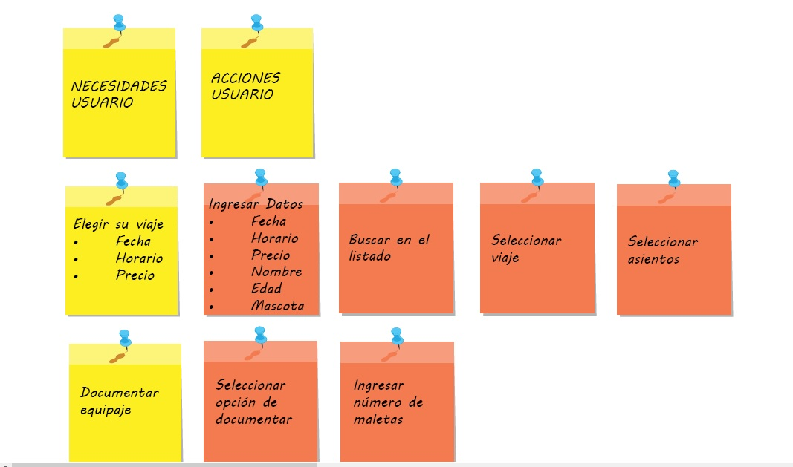

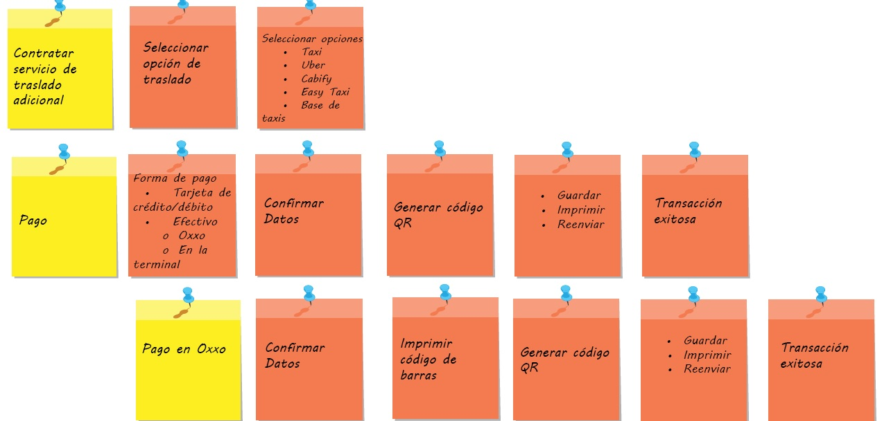

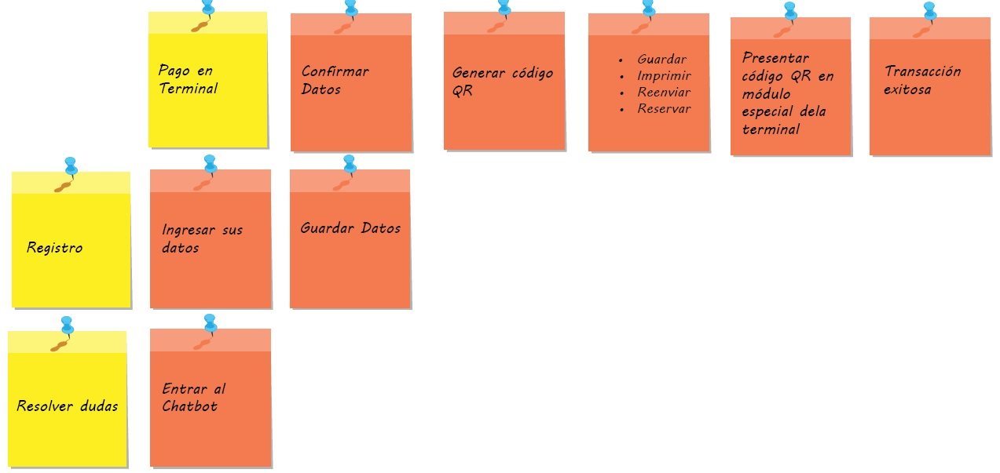

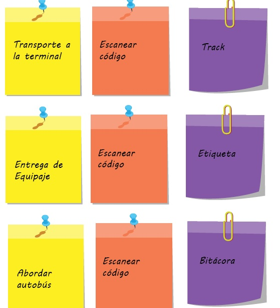

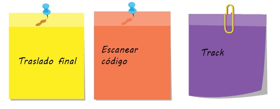

### Prototipo


En este caso el diseño del prototipo no se llevó a cabo, en su lugar se creó una Landing Page a través de Wordpress y se utilizaron herramientas como Google Analitics y Hotjar para analizar el comportamiento con los usuarios
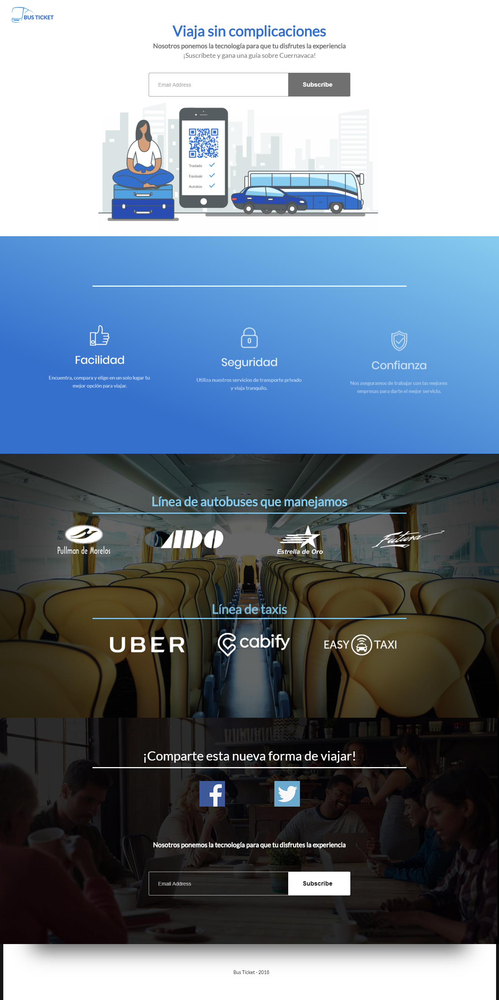

```
Las métricas son:

-Ratio de conversión a Leads, en base al número de usuarios registrados
-Coste de Adquisición al cliente (CAC)
-Porcentaje de coste de marketing adquiriendo un cliente (M% - CAC)
-Ratio del ciclo de vida del cliente (LTV) / CAC
-Tiempo de recuperación de la inversión CAC
-Porcentaje de clientes originados desde marketing
-Porcentaje de clientes influenciado por marketing
```
#### Insights de Google Analitics

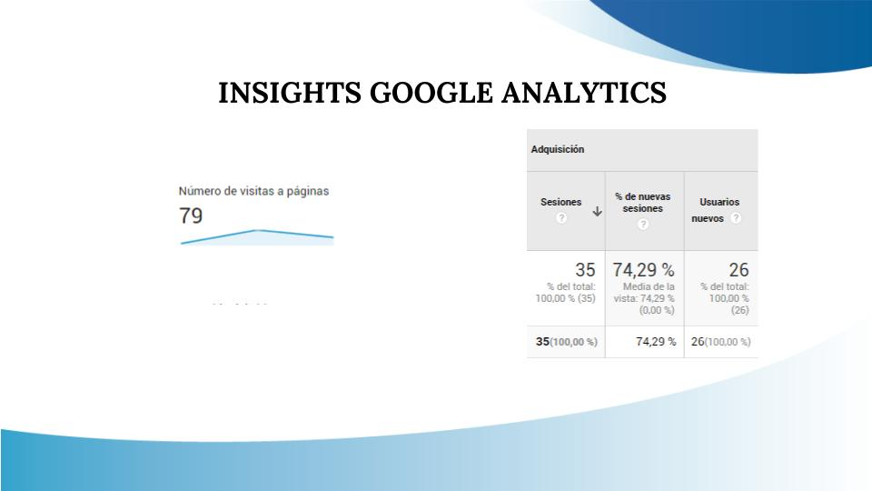


<hr>
Equipo Conformado por:

* Elzbeth Blanco: Product Owner
* Jocelyn Esquivel: UX Research
* Lia Laguna: Designer
* Gabriela Colín: Designer
